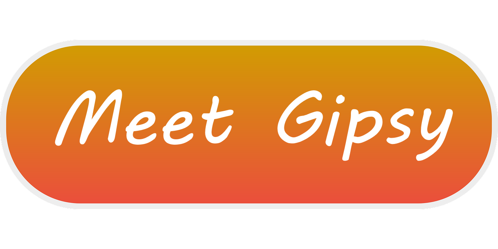

<!--
Ce programme est régi par la licence CeCILL soumise au droit français et
respectant les principes de diffusion des logiciels libres. Vous pouvez
utiliser, modifier et/ou redistribuer ce programme sous les conditions
de la licence CeCILL diffusée sur le site "http://www.cecill.info".
-->

  

# 👻 Gipsy

Gipsy is modular, free and open-source Discord bot whose focus on accessibility and customization. It maintained with ❤️ by volunteers inside the [Gunivers](https://gunivers.net/) community. It is written in Python and uses the Discord.py library and the project is open to experimented people as well as beginners!

*This button redirect you to a more complete presentation with invitation links, list of features, self-hosting instructions and more.*

